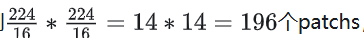
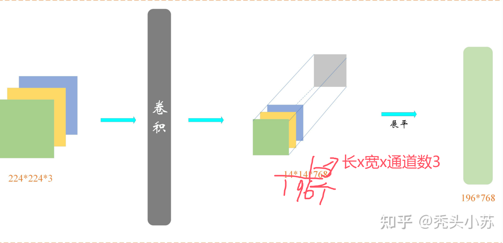

# VIT

## 理论

- Transformer和CV中的VIT这两个结构输入有什么区别？

  - 两者都是一个tensor张量

  - 而从变量的维度来看，NLP中的输入往往是**二维的tensor**，而CV中往往是一个**三维的RGB图像**。**「【都忽略了Batch维度】」** 这种维度的不统一会导致我们**不能直接将图片数据喂入到Transformer结构**中去，而是需要进行一定的**维度转换**，即将**三维的tensor转换成二维的tensor**，这个过程被称为**patch_embedding**。

    - 设原图的尺寸为224\*224\*3，每个块（patch）的尺寸为16∗16∗3，则我们一共会得到， 所以经分块后，一个224\*224\*3的三维tensor会变成一个196\*(16\*16\*3)，每个 16×16的块包含 16×16×3=768个元素(像素),将每个块展平为一维向量后,即196*768的二维张量。（**进行两件事，将原图进行patch分成多个小的patch分后的图片以通道方向进行拼接，二将张量变为二维patch个数不变，将长与宽与通道进行拉直**)

    - **此时的每一行就代表了一个图片**

    - **步骤：**那么由224\*224\*3变换到196\*768的这个过程是可以由卷积实现的，即我们对原图进行卷积，卷积核大小为16\*16\*3 ,步长为16，padding=0，（相当于分割）卷积核个数为768，卷积后，我们会得到特征图，其尺寸为14\*14\*768，接着将前两个维度展平，就得到了维度为196*798的tensor。

    - 

    - ```
      import torch
      import torch.nn as nn
      
      # 假设输入的三维 tensor 形状为 (batch_size, 3, 224, 224)
      
      batch_size = 8  # 示例 batch_size
      input_tensor = torch.randn(batch_size, 3, 224, 224)
      
      # 定义卷积层
      
      conv_layer = nn.Conv2d(in_channels=3, out_channels=3, kernel_size=16, stride=16)
      
      # 进行卷积操作
      
      output_tensor = conv_layer(input_tensor)  # 输出形状为 (batch_size, 3, 14, 14)
      
      # 展平为二维 tensor
      
      output_tensor = output_tensor.view(batch_size, -1, 768)  # 输出形状为 (batch_size, 196, 768)
      ```

      

      

      

  positional encoding（standard learnable 1D position embeddings）：ViT同样需要加入位置编码，位置编码可以理解为一张表，表一共有N行，N的大小和输入序列长度相同，每一行代表一个向量，向量的维度和输入序列embedding的维度相同（768）。注意位置编码的操作是**sum**，而不是concat。加入位置编码信息之后，维度依然是**197x768**

   LN/[multi-head attention](https://zhida.zhihu.com/search?content_id=187046120&content_type=Article&match_order=1&q=multi-head+attention&zhida_source=entity)/LN：LN输出维度依然是197x768。多头自注意力时，先将输入映射到q，k，v，如果只有一个头，qkv的维度都是197x768，如果有12个头（768/12=64），则qkv的维度是197x64，一共有12组[qkv](https://zhida.zhihu.com/search?content_id=187046120&content_type=Article&match_order=3&q=qkv&zhida_source=entity)，最后再将12组qkv的输出拼接起来，输出维度是197x768，然后在过一层LN，维度依然是**197x768**

   MLP：将维度放大再缩小回去，197x768放大为197x3072，再缩小变为**197x768**

  一个block之后维度依然和输入相同，都是197x768，因此可以堆叠多个block。最后会将特殊字符cls对应的输出 zL0 作为encoder的最终输出 ，代表最终的image presentation（另一种做法是不加cls字符，对所有的tokens的输出做一个平均），如下图公式(4)，后面接一个MLP进行图片分类

  

  其中输入image x∈RH×W×C ， ， C 是通道数， P 是patch大小，一共有 N 个patches， N=HW/P2
